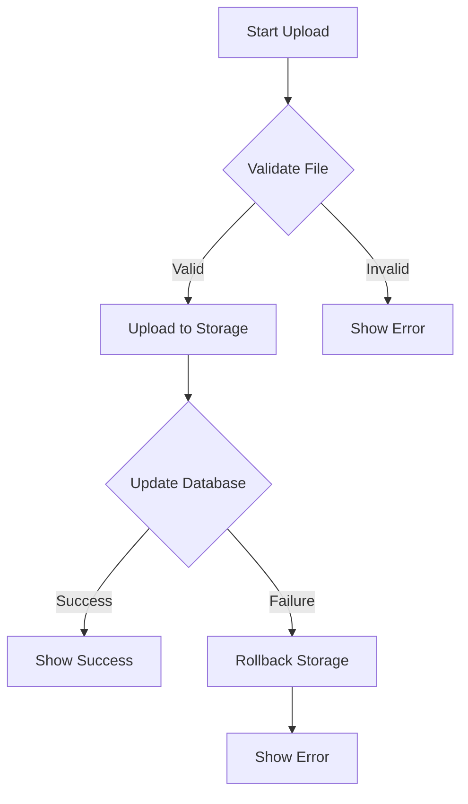
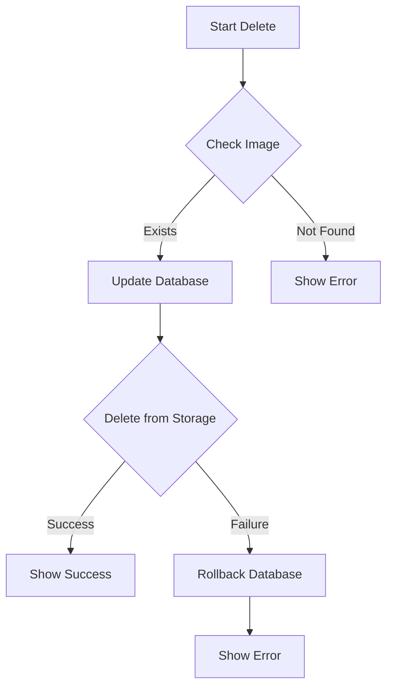

# Image Management System Documentation

## Overview

The image management system provides a comprehensive solution for handling product and variant images, including upload, storage, cleanup, and error recovery mechanisms.

## Core Components

### 1. Storage Service
```typescript
class StorageCleanupService {
  static async isImageOrphaned(imagePath: string): Promise<boolean>;
  static async deleteIfOrphaned(imagePath: string): Promise<boolean>;
  static async cleanupOrphanedImages(): Promise<void>;
}
```

### 2. Image Service
```typescript
class ProductImageService {
  static async uploadProductImage(file: File): Promise<UploadResult>;
  static async uploadVariantImage(file: File): Promise<UploadResult>;
  static async deleteVariantImage(path: string): Promise<void>;
  static getImagePath(url: string): string | null;
}
```

### 3. Image Upload Hook
```typescript
function useImageUpload({
  type,
  onSuccess,
  onError
}: UseImageUploadOptions) {
  const uploadImage = async (file: File) => Promise<UploadResult>;
  return { uploadImage };
}
```

## Implementation Details

### 1. Image Upload Flow



### 2. Image Deletion Flow



## Error Handling

### 1. Upload Errors
```typescript
try {
  const result = await uploadImage(file);
  onSuccess?.(result);
} catch (error) {
  const errorMessage = error instanceof Error
    ? error.message
    : 'Failed to upload image';
  onError?.(new Error(errorMessage));
}
```

### 2. Deletion Errors
```typescript
try {
  await deleteImage(path);
  onSuccess?.();
} catch (error) {
  await rollbackDatabaseUpdate();
  onError?.(error);
}
```

## Storage Cleanup

### 1. Orphaned Image Detection
```typescript
const isOrphaned = await StorageCleanupService.isImageOrphaned(imagePath);
if (isOrphaned) {
  await StorageCleanupService.deleteIfOrphaned(imagePath);
}
```

### 2. Cleanup Process
```typescript
// List all images
const { data: files } = await supabase.storage
  .from('images')
  .list();

// Process each file
for (const file of files) {
  await StorageCleanupService.deleteIfOrphaned(file.name);
}
```

## Database Schema

### Image Operation Log
```sql
CREATE TABLE "ImageOperationLog" (
    id UUID DEFAULT uuid_generate_v4() PRIMARY KEY,
    entity_type VARCHAR(50) NOT NULL,
    entity_id UUID NOT NULL,
    operation_type VARCHAR(50) NOT NULL,
    status VARCHAR(50) NOT NULL,
    error_message TEXT,
    created_at TIMESTAMP WITH TIME ZONE DEFAULT NOW()
);

CREATE INDEX idx_image_operations_entity
ON "ImageOperationLog"(entity_type, entity_id);
```

## Best Practices

1. Error Recovery
   - Implement rollback mechanisms
   - Log all operations
   - Maintain data consistency
   - Handle edge cases
   - Provide clear feedback

2. Performance
   - Validate before upload
   - Optimize image sizes
   - Use proper indexes
   - Implement caching
   - Batch operations

3. Security
   - Validate file types
   - Check file sizes
   - Implement access control
   - Sanitize file names
   - Log operations

4. Maintenance
   - Regular cleanup
   - Monitor storage usage
   - Track error rates
   - Update documentation
   - Review logs
